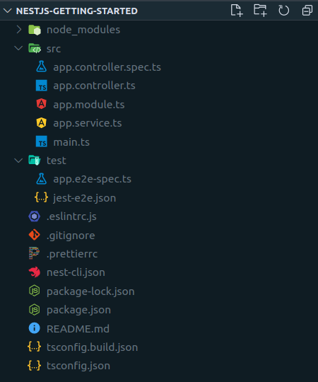

# Nest.js. Первые шаги

## Прежде, чем начать

Задача этой статьи - помочь новичкам сделать первый шаг в освоении одного из самых популярных фреймворков для серверного Javascript - [Nest.js](https://nestjs.com/)


Для комфортного усвоения материала статьи, желательно:
* знание javascript на среднем уровне
* знание основ typescript
* базовые знания Node.js (желательно, опыт с _express.js_)
* знание базовых понятий MVC (Model-View-Controller)

Также нам понадобится уставленные на компьютер:

* Node.js версии 10+
* Docker (для лёгкого развёртывания БД)

## Введение

Зачем нам нужен фреймворк?

Большинство задач в программировании - типовые. Если не брать каких-то специфических бизнес-кейсов, скорее всего все возможные задачи уже решены другими программистами и не по одному разу. Не зря в среде программистов среде так часто можно услышать шутки о "велосипедостроении".

Фреймворки помогают нам писать меньше шаблонного кода и сосредоточиться на том, какую полезную работу должна делать наша программа.

Первым супер-популярным веб-фреймворком для Node.js был _express.js_. Nest.js значительно расширяет его функциональность, а кроме того помогает разработчику строить приложение в соответствии с лучшими архитектурными практиками.

Для примера, мы напишем небольшой блог, в котором можно будет просматривать и добавлять статьи. Конечно, это будет очень простое приложение, но его будет достаточно для первого знакомства.

## Создадим проект

Чтобы каждый раз не приходилось настраивать проект с нуля, разработчики Nest.js вооружили нас консольной утилитой - *@nestjs/cli*. Установим её глобально:
``` bash
npm i @nestjs/cli -g
```

Теперь в Вашей директории с проектами, выполним команду `nest new`, указав имя проекта.
``` bash
nest new nestjs-getting-started
```

Когда cli закончит свою работу мы можем перейти в директорию *nestjs-getting-started* и посмотреть, что получилось:



Все основные зависимости уже установлены, сборка typescript настроена. Кроме этого создана папка src, которая и будет интересовать нас больше всего. Здесь уже есть несколько файлов - это демонстрационное приложение от создателей Nest.js.

Самое приятное, что приложение уже рабочее и его можно запустить. Делается это при помощи команды
``` bash
npm run start:dev
```
Теперь если через ввести в адресную строку браузера *http://localhost:3000*, мы увидим возвращённую сервером фразу "Hello world!".

> Запущенное командой `npm run start:dev` приложение будет перезагружаться каждый раз, когда изменяется исходный код проекта.

Остановить работающее приложение можно при помощи комбинации клавиш `Ctrl+C`

## Точка входа
 
Точкой входа в приложение на Nest.js, как и в любом другом MVC-подобном фреймворке, являются **контроллеры**. Пока в приложении имеется один: *app.controller.ts*:

``` typescript
import { Controller, Get } from '@nestjs/common';
import { AppService } from './app.service';

@Controller()
export class AppController {
  constructor(private readonly appService: AppService) {}

 @Get()
 getHello(): string {
   return this.appService.getHello();
 }
}
```

Обратите внимание, что класс AppController и метод getHello() помечены декораторами @Controller() и @Get() соответственно. Nest.js очень широко использует декораторы, поэтому к ним лучше сразу привыкать. Они позволяют писать приложение в более декларативном ключе, указывая **что** мы хотим сделать, оставляя детали реализации фреймворку.

Так декоратор @Get() говорит, что когда в приложение придёт HTTP-запрос методом GET на роут '/' (это значение по умолчанию, поэтому его можно не указывать), его следует направить в метод getHello().

Соответственно, значение, которое вернётся из метода, будет отправлено в теле ответа. Код ответа по умолчанию для GET-запросов - 200.

Метод getHello() и конструктор мы пока удалим. Взамен, создадим метод index(), который будет возвращать статьи. Контроллер приобретёт такой вид:

``` typescript
import { Controller, Get } from '@nestjs/common';

@Controller()
export class AppController {
  @Get()
  index() {
    return { articles: [] };
  }
}
```

Теперь, зайдя на *http://localhost:3000* мы вместо "Hello world" увидим такой JSON:
``` json
{
  "articles": []
}
```

> Обратите внимание, что мы возвращаем не "голый" массив, а заворачиваем его в объект c ключом articles. Нам это пригодится чуть дальше.


## Статьи

Пришло время наполнить блог статьями. Но что такое "статья"? Каждая статья - это объект, который будет иметь уникальный идентификатор, заголовок и контент.

Создадим в папке *src* новый файл *article.model.ts* и в нём опишем класс статьи:

``` typescript
export class Article {
  id: number;

  title: string;

  content: string;

  constructor (title: string, content: string, id?: number) {
    this.id = id;
    this.title = title;
    this.content = content;
  }
}
```

> Почему id - необязательный параметр, выяснится позже - когда будем подключать базу данных.

Теперь представим что у нас в блоге уже есть парочка статей. Создадим файл *articles.ts*:

``` typescript
import { Article } from './article.model';

export const articles: Article[] = [
 new Article('The first one', 'Lorem ipsum ....', 1),
 new Article('The second one', 'Lorem ipsum ....', 2)
]
```

Осталось вернуть массив статей из метода index() в контроллере:

``` typescript
import { articles } from './articles';

@Controller()
export class AppController {
  @Get()
  index() {
    return { articles };
  }
}
```

Если теперь запустить приложение, мы увидим в браузере следующее:

``` json
{
  "articles": [
    {
      "id": 1,
      "title": "The first one",
      "content": "Lorem ipsum ...."
    },
    {
      "id": 2,
      "title": "The second one",
      "content": "Lorem ipsum ...."
    }
  ]
}
```

## Добавляем HTML-шаблоны

Для того, чтобы пользователю было комфортнее работать с сайтом, сервер должен вернуть браузеру ответ не в формате json, а в виде html-страницы.

Создадим в корне проекта директорию *views* - в ней мы в дальнейшем будем размещать HTML-шаблоны.

### Устанавливаем шаблонизатор

Nest.js по умолчанию не устанавливает никаких движков шаблонизации, т. к. не знает, какой именно по душе пользователю. Мы для этого примера возьмём *pug* (ранее известный, как jade). Соответствующий пакет нам придётся установить самостоятельно:
 
``` bash
npm install pug
```

Чтобы подключить *pug*, перепишем функцию bootstrap (*main.ts*) следующим образом:

``` typescript
import { join } from 'path';
import { NestExpressApplication } from '@nestjs/platform-express';

async function bootstrap() {
  /*
  * Добавим параметр типа к методу create, показывая, что мы хотим работать
  * с объектом app, как с приложением express.
  */
  const app = await NestFactory.create<NestExpressApplication>(AppModule);

  // Сообщим приложению, где искать наши views.
  app.setBaseViewsDir(join(__dirname, '../views'));

  // И укажем, какой шаблонизатор использовать
  app.setViewEngine('pug');
  await app.listen(3000);
}
```

### Первый шаблон

Наш первый шаблон *index.pug* будет выглядеть так:

``` pug
doctype html
html(lang="en")
  head
    meta(charset="UTF-8")
    meta(http-equiv="X-UA-Compatible", content="IE=edge")
    meta(name="viewport", content="width=device-width, initial-scale=1.0")
    title SuperBlog!
  body
    h1 Welcome to SuperBlog!
    // Конструкция "each" позволяет перебрать массив и для каждого элемента сгенерировать разметку
    ul
      each a in articles
        // #{...} - интерполяция. Так шаблонизатор понимает, что сюда надо встроить данные.
        li #{a.title} <a href="..."> Читать</a>
```

> Добавление стилей выходит за рамки данной статьи, поэтому оставим это на усмотрение читателя.

В контроллере добавим к методу index декоратор @Render() (импортируется из пакета @nestjs/common):
``` typescript
import { Render } from ‘@nestjs/common’;
 
@Controller()
export class AppController {
  @Get()
  @Render('index')
  index() {
    return { articles };
  }
}
```

@Render('index') указывает фреймворку, что те данные, которые возвращаются из метода нужно не просто вернуть браузеру, а использовать для отрисовки шаблона с названием index (расширение не важно).

Готово. Теперь при запуске приложения, мы увидим то, что и ожидали - html-страницу с двумя статьями.

## Добавляем просмотр статей

В *app.controller.ts* создадим новый метод:

``` typescript
@Get(':id')
@Render('article')
getById(@Param('id', ParseIntPipe) id: number) {
  return articles.find(article => article.id === id);
}
```

Строка ':id' в декораторе Get() означает, что в этот метод будут направлены запросы на корневой роут с параметром, например: GET http://localhost/1

При помощи декоратора **@Param()** мы можем достать этот идентификатор из URL, преобразовать его к числу (ParseIntPipe) и использовать для поиска нужной статьи.

> Кроме декоратора @Param() в Nest.js есть также декораторы **@Query()** для query-параметров и **@Body()** для тела запроса.

Добавим в папку *views* шаблон *article.pug*:
``` pug
doctype html
html(lang="en")
  head
    meta(charset="UTF-8")
    meta(http-equiv="X-UA-Compatible", content="IE=edge")
    meta(name="viewport", content="width=device-width, initial-scale=1.0")
    title #{title}
  style
  body
    h1 #{title}
    p #{content}
    a(href="/") Назад
```

Шапка будет та же самая, только в тэге "title" мы выведем название статьи. В теле страницы - ожидаемо title и content, а также ссылка "назад" - на главную страницу.

Осталось починить ссылки на главной странице:
``` pug
li #{post.title}
  a(href=post.id) Читать
```

Теперь, зайдя на главную страницу, можно кликнуть по ссылке "Читать" у любой из статей и увидеть содержимое статьи. А при клике на "Назад" - вернуться к списку статей. Также, можно зайти на страницу по прямой ссылке, например *http://localhost:3000/1*

## Добавляем статью

Чтобы создать новую статью, браузер должен отправить на сервер title и content POST-запросом. Чтобы реализовать это, добавим в контроллер два новых метода:

``` typescript
@Get('create')
@Render('create-article')
getForm(): void {
  return;
}

@Post('articles')
@Redirect('/', 301)
create(@Body() body: any): void {
  const id = articles.length + 1;
  const article = new Article(body.title, body.content, id);
  articles.push(article);
}
```

Метод getForm() не требует никакого возвращаемого значения - он просто возвращает статический HTML.

В методе create() реализуем добавление статьи в коллекцию. Думаю, читатель уже догадался, что декоратор @Post() означает одноимённый HTTP-глагол. Декоратор @Body() указывает фреймворку, что данные для параметра нужно брать из тела запроса. И, наконец, декоратор @Redirect(‘/’, 301) говорит о том, что после добавления статьи, требуется переадресовать пользователя. Первый аргумент - ‘/’ обозначает корневой роут (то есть, главную страницу), а 301 - это код ответа.

Шаблон *create-article.pug* будет выглядеть так:

``` pug
doctype html
html
  head
    title Новая статья
  style
  body
    h1 Новая статья
    form(method="POST" action="/")
      input(type="text" name="title")
      input(type="text" name="content")
      button(type="submit") Создать
```

Добавление статей реализовано. На страницу добавления можно попасть, введя в адресной строке *http://localhost:3000/create*. Чтобы было чуть удобнее, добавим ссылку на эту страничку вниз списка статей. *index.pug* приобретёт такой вид:
``` pug
doctype html
html
  head
    title SuperBlog!
  style
  body
    h1 Welcome to SuperBlog!
    ul
      each post in posts
        li #{post.title}  
          a(href='articles/' + post.id) Читать
    a(href="create") Создать
```

## Подключаем базу данных

Пока наш блог хранит статьи в оперативной памяти, они будут теряться при каждом перезапуске приложения. Чтобы избавиться от этой проблемы, нам нужно организовать долговременное хранение данных.

Мы используем для этого *postgresql* - самую популярную на сегодня свободную СУБД. Проще всего поднять базу данных локально при помощи *docker*:

``` bash
sudo docker run --name local_pg \
  -e POSTGRES_ROOT_PASSWORD=toor \
  -e POSTGRES_DATABASE=test \
  -e POSTGRES_USER=test \
  -e POSTGRES_PASSWORD=test \
  -d -p 127.0.0.1:5432:5432 postgres:10.8-alpine
```

Когда docker закончит свою работу и контейнер с базой данных запустится, можно заняться подключением.

Для работы с базой мы будем использовать **ORM** (Object-Relational Mapping System) под названием *typeorm*. Эта система также как и Nest.js основана на декораторах и хорошо интегрируется с фреймворком.

Установим необходимые пакеты:

``` bash
npm i typeorm pg @nestjs/typeorm
```

Теперь мы можем подключить базу данных к проекту.

``` typescript
import { Module } from '@nestjs/common';
import { TypeOrmModule } from '@nestjs/typeorm';
import { AppController } from './app.controller';

@Module({
  imports: [
    TypeOrmModule.forRoot({
      type: 'postgres',
      host: 'localhost',
      port: 5432,
      username: 'test',
      password: 'test',
      database: 'test',
      logging: true,
      synchronize: true,
    })
  ],
  controllers: [AppController]
})
export class AppModule {}
```

Особое внимание следует здесь уделить параметру `synchronize: true`.  Эта настройка означает, что при каждом запуске приложения, схема БД будет приобретать ту форму, которую мы описываем в коде (классы помеченные @Entity). Так **никогда** нельзя делать в production-окружении. Но в самом начале, когда мы только только намечаем приложение - это очень удобно.


Функционально мы пока ничего в приложении не поменяли, но при старте, если подключение БД прошло успешно, мы увидим в консоли несколько SQL-запросов (это работает наш syncronize: true)

## Переносим статьи в базу данных

Перепишем файл *article.model.ts*:
``` typescript
import { BaseEntity, Column, Entity, PrimaryGeneratedColumn } from 'typeorm';

@Entity({ name: 'articles' })
export class Article extends BaseEntity {
  @PrimaryGeneratedColumn()
  id: number;

  @Column()
  title: string;

  @Column()
  content: string;

  constructor(title: string, content: string, id?: number) {
    super();
    this.id = id;
    this.title = title;
    this.content = content;
  }
}
```

Здесь мы видим несколько новых декораторов:

- @Entity() - означает, что в базе данных нашей модели соответствует таблица.
- @Column() - полю класса соответствует поле в таблице
- @PrimaryGeneratedColumn() - автоматически генерируемый идентификатор, которой будет в нашей таблице первичным ключом.

Поскольку у нас включена синхронизация, в БД уже создалась таблица *articles*. Вы можете убедиться в этом при помощи любой утилиты для работы с БД, например *dbeaver* или *DataGrip*

Последний штрих: удалим файл *articles.ts* и перепишем *app.controller.ts* так, чтобы он использовал базу данных:

``` typescript
@Controller()
export class AppController {
  @Get()
  @Render('index')
  async index() {
    return {
      articles: await Article.find(),
    };
  }
 
  @Get('articles/:id')
  @Render('article')
  async post(@Param('id', ParseIntPipe) id: number) {   
    return Article.findOne({ id });
  }
 
  @Get('create')
  @Render('create-article')
  getForm(): void {
    return;
  }

  @Post('articles')
  @Redirect('/', 301)
  async create(
    @Body() body: { title: string; content: string },
  ): Promise<void> {
    const article = new Article(body.title, body.content);
    await article.save();
  }
}
```

Теперь наши статьи будут сохраняться в базе данных и никуда не пропадут, даже если мы перезапустим сервер.

## Заключение

Как Вы могли убедиться, Nest.js позволяет нам написать простое приложение с минимальными усилиями. Для больших и сложных приложений у него также достаточно возможностей.

Автор надеется, что данная статья поможет читателям сделать первый шаг в изучении Nest.js и в будущем пополнить ряды почитателей этого прекрасного фреймворка.
